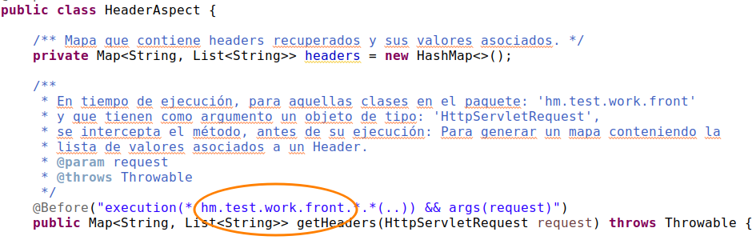

# Manual usuario
___

## 1. Consideraciónes y supuestos

### 1.1 Rquerimientos
* Una versión instalada de Java 1.8

* Una versión instalada de Maven 3.6.3

* El IDE de su preferencia

* Una versión instalada del control de versiones Git.

### 1.1 Configuración de ambiente de desarrollo
* __JAVA_HOME__. Debe agregar la variable de ambiente al PATH de su SO apuntando a la ruta de instalación de Java con el nombre JAVA_HOME. 
	> Ejemplo:
	>	export JAVA_HOME="/home/miusuario/java_1.8"

* En caso de requerir acceso directo a los comandos de compilación y ejecución de Java, actualizar el PATH de sus variables de ambiente,  egrear la ruta del directori __'/bin'__ a la variable JAVA_HOME recién creado.
	> Ejemplo: 
	>	PATH="$PATH;$JAVA_HOME/bin;"

* Realizar un proceso similar a los puntos anteriores para agregar las variables de Maven que sean necesarias.

### 1.2 Configuración de aplicación.

* Solo se incluye un archivo denominado: HeaderAspect.java, del cual se explicará en breve la forma de empleo de la misma.

#### 1.2.2 Supuestos
* Dispone de un IDE en el cual tiene cargada una aplicación que contiene al menos un Servicio Rest.

* está trabajando sobre Spring boot (Se sugiere la versión: 2.3.3.RELEASE)

* Tiene configurados en el archivo __pom.mlx__ los siguientes 'starter':
	- spring-boot-starter-web
	- spring-boot-starter-aop

* Los controladores implementados para cada Servicio Rest, con que cuenta la aplicación están ubicados en el paquete: 
	- hm.test.work.front
__'Nota:'__ No hay alguna restricción en el uso de otro paquete, pero en caso de requerir otra ruta para el controlador, deberá ajusta la ruta en la clase: __'HeaderAspect'__, como se muestra en la imagen siguiente:

* La clase __'HeaderAspect'__: Deberá ser descargada y localizada en el siguiente paquete dentro de su proyecto: __'hm.test.work.aop'__
'Nota.' En caso de ubicar la clase citada, recuerde modificar la clase para incluir el paquete en el cual fue ubicada la clase.

### Consideraciónes de la Clase desarrollada
* La clase desarrollada corresponde a un Aspecto, implementado con String AOP.

* El objetivo de la clase la implementación de dos métodos que funcionen bajo el paradigma de orientación a Aspectos, que se ejecutarán antes de la ejecución a un método de un 'controlador' que representa un 'endpoint' de un Servicio Rest). 

__Nota.__ La implementación de dichos métodos responde a los requerimientos solicitados. Queda pendiente en la definició del requerimiento, la deifinición del momento en que debe ser 'cortado (interceptado)' el método en cuestión (__@Before__, @Around, etc). Se elige la primera opción para la presente versión, solo con fines ilustrativos de la implementación de una Aspecto en un proyecto cualesquiera. 
